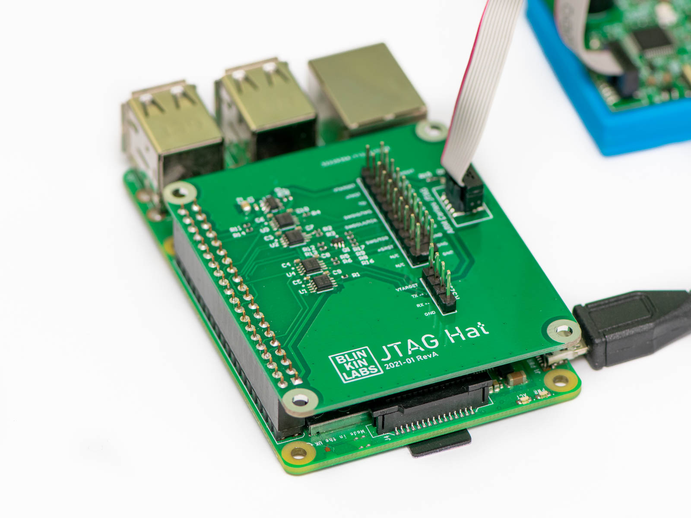
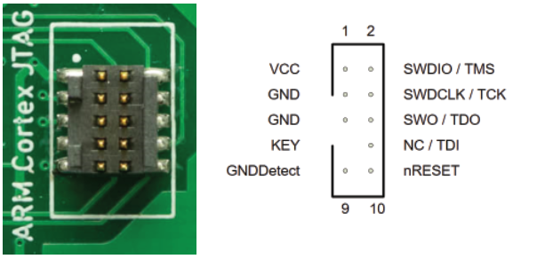
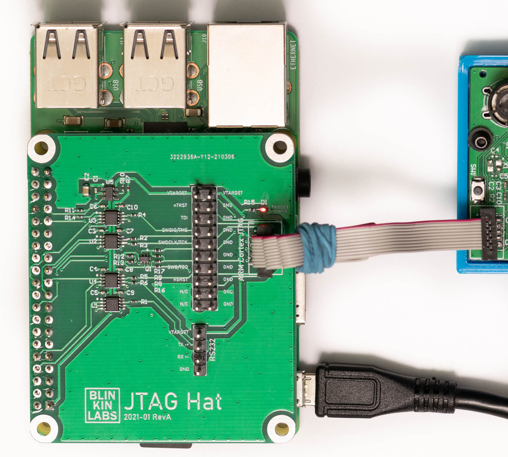
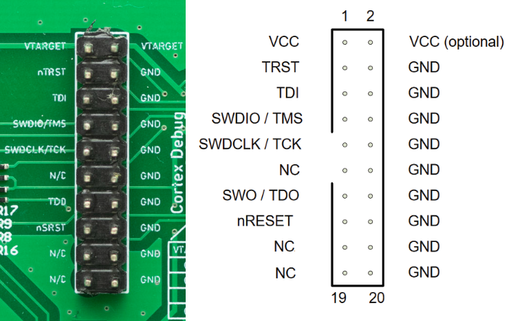
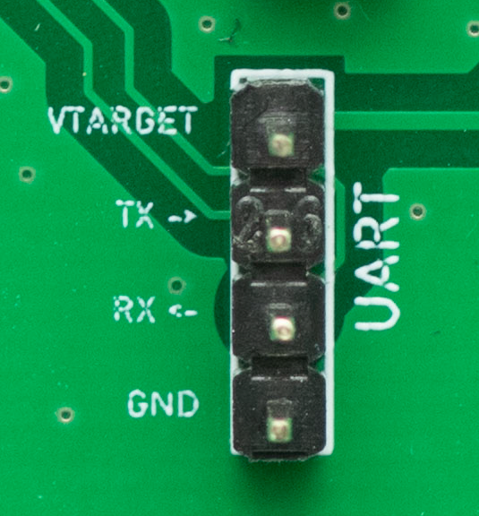
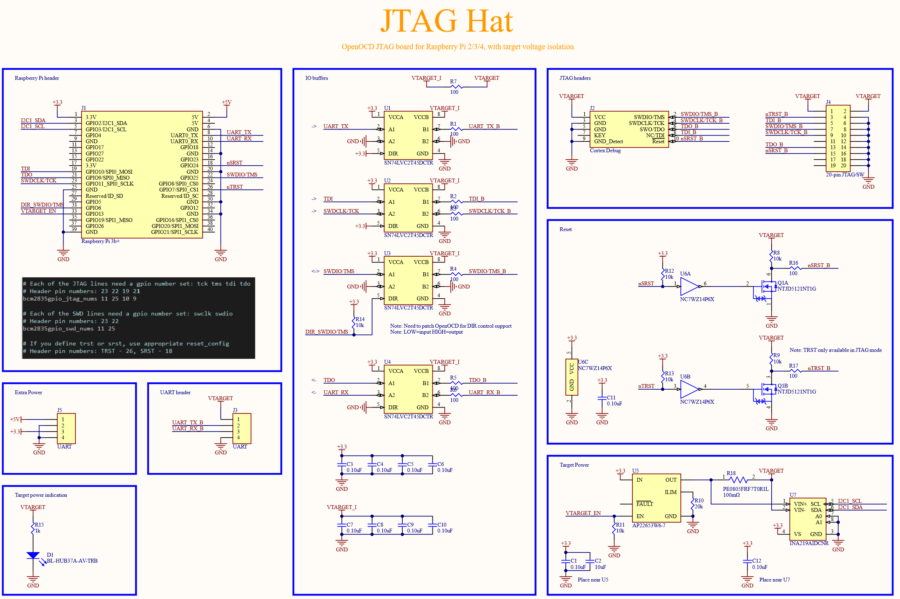

# JTAG Hat



Convert your Raspberry Pi 2/3/4 into a networked JTAG debugger!

Features:
* Level-shifted JTAG / SWD programming interface, supports 1.8V to 3.3V targets (TODO: is 5V supported?)
* Designed to work with OpenOCD, which supports debugging a large number of devices (STM32, etc)
* Selectable target power, to power your device from the RPi 3.3V suppy
* Level-shifted UART interface connected to RPi serial port
* Hardware reset via a pull-down transistor

The JTAG Hat is designed to work with [OpenOCD](http://openocd.org/), and provides a .05" 10-pin [Cortex Debug Connector](https://documentation-service.arm.com/static/5fce6c49e167456a35b36af1), with pins to support debugging devices with either a JTAG (TCK/TMS/TDI/TDO) or SWD (SWDIO/SWDCLK) programming interface. A traditional .1, 20-pin JTAG header is also provided, which can be used with normal jumper wires for more flexibiity.

## Setup

1. Use [Rasbperry Pi Imager](https://www.raspberrypi.org/software/) to image the micro SD card with 'Raspberry Pi OS Lite'

2. [Enable WiFi](https://www.raspberrypi.org/documentation/configuration/wireless/headless.md) by adding 'wpa_supplicant.conf' to the boot partition:
```
country=US
ctrl_interface=DIR=/var/run/wpa_supplicant GROUP=netdev
update_config=1
    
network={
    ssid="NETWORK-NAME"
    psk="NETWORK-PASSWORD"
}
```
3. [Enable ssh](https://www.raspberrypi.org/documentation/remote-access/ssh/README.md) by adding an empty 'ssh' file to the boot partition:
```
touch ssh
```

4. Boot the pi, and check the router to determine the IP address, then SSH into it

5. Use 'sudo raspi-config', and under the 'Interfacing Options' menu, enable SSH at boot.

6. Update packages and install git:
```
sudo apt update
sudo apt upgrade
sudo apt install git autoconf libtool libusb-1.0-0-dev screen
```

7. Download and build our [patched](https://github.com/Blinkinlabs/OpenOCD/commit/de3ccf1de793416172838cf2676b77498c0fd1d7) version of OpenOCD:
```
git clone https://github.com/Blinkinlabs/OpenOCD.git openocd
cd openocd

./bootstrap
./configure --enable-sysfsgpio --enable-bcm2835gpio
make
sudo make install
```

## Use it

1. Connect using the Arm Cortex Debug connector


This connector works well if your target board has one of these connectors. This connector supports both JTAG and SWD connection modes, and has a reset pin controlled by 'srst'. It's very tidy:



-or-

2.  Connect using the 20-pin 'legacy' connector


This connector works well if your target board has one of these connectors, or if you want to use jumper wires to connect to .1" headers on a board. This connector supports both JTAG and SWD connection modes, and has a reset pin controlled by 'srst', as well as one  controlled by 'trst'. Note that some of the optional signals (RTCK, DBGRQ, DBACK) are not supported by OpenOCD, and are not present on this connector.

For SWD mode, you'll need at least GND,SWDIO, and SWDCLK. For JTAG mode, you'll need GND,TCK,TDI,TDO, and TMS.

3. (optional) Enable target power

The JTAG Hat can provide an optional 3.3V, 500mA* supply to the target. To enable it, RPi GPIO13 should be set to an output:
```
echo 13 > /sys/class/gpio/export
echo out > /sys/class/gpio/gpio13/direction
echo 1 > /sys/class/gpio/gpio13/value
```

Similarly, to turn it off:
```
echo 0 > /sys/class/gpio/gpio13/value
```
Note: If your target board is already powered, do not enable target power! The red LED on the board will light up when the target power voltage is present.

4. Start an OpenOCD session for an STM32F0 target:
```
sudo openocd -f interface/raspberrypi2-native.cfg \
             -c "bindto 0.0.0.0; transport select swd" \
             -c "adapter speed 1000" \
             -f target/stm32f0x.cfg
```

Now you can connect to the server using GDB, and flash new code, dump things, etc.

## UART header



The JTAG Hat also has a level-translated UART header. The UART situation on Raspberry Pi is a [little complicated](https://www.raspberrypi.org/documentation/configuration/uart.md), so a little configuration is needed to make this pin work.

### Setup

1. Disable Bluetooth (Raspberry Pi 3,4 only): On the Raspberry Pi 3 and 4, the UART is normally connected to the Bluetooth chip, so we'll first need to disable that to free up the pins. Add the following to /boot/config.txt:
```
dtoverlay=disable-bt
```
2. Enable the serial port and configure it for general purpose use. Run 'sudo raspi-config', then select '3 Interface Options', 'P6 Serial Port'. Choose 'No' to disable the login shell over serial, then 'Yes' to enable hardware serial. Choose 'Ok' to confirm the settings, then 'Finish' to apply them. Choose 'Yes' to reboot the system and apply the changes.

3. Once the system reboots, check that the serial port is configured correctly:
```
ls -l /dev/serial0
```
This should now point to ttyAM0:
```
lrwxrwxrwx 1 root root 7 Mar 24 15:10 /dev/serial0 -> ttyAMA0
```

### Using the serial port

Once the serial port is configured, it should be ready for use. You can test it using screen:
```
sudo apt-get install screen

screen /dev/serial0 115200
```

Tip: Make sure to connect the ground wire!

Tip: Make sure Vtarget is enabled, otherwise the serial port buffers won't work!

## Hardware design



## License

The board design is licensed under [TODO] and documentation is released under [Attribution-ShareAlike 4.0 International](https://creativecommons.org/licenses/by-sa/4.0/legalcode)
